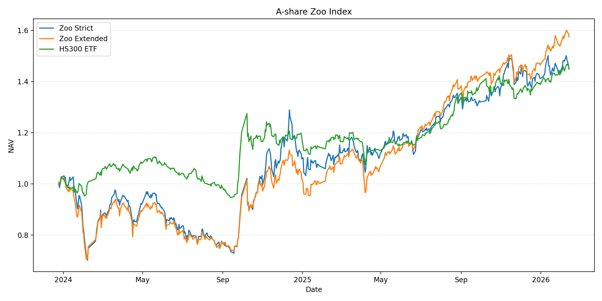

# 动物园指数

可能是全网第一个A股动物园指数：把A股简称里含动物词的股票收编成组合，按固定规则每日更新，并与沪深300对比。



说明：图像由每日脚本生成，初次运行后才会显示。

## 功能概览

* 支持“严格动物园 / 扩展动物园”双指数

* 使用规则词表 + 黑白名单，结果可复现

* 每日生成净值、曲线图、徽章数据与静态页面

## 快速开始

1. 安装依赖

```bash
pip install .
```

2. 配置 Tushare Token

```bash
export TUSHARE_TOKEN=你的token
```

3. 运行每日更新

```bash
python src/run_daily.py --date 20240102
```

未指定日期时会默认使用上海时区下最近一个完整交易日（若当天数据未就绪会回退到上一个交易日）。

4. 回填历史区间（可选）

```bash
python src/run_daily.py --backfill 250
```

也可以直接 `python src/run_daily.py --backfill`，默认回填最近 2 年交易日。
如需按年份回填，使用 `--backfill-years 2`；需要全量重算区间时加 `--backfill-mode all`。
回填会增量更新 `docs/nav.csv` 并刷新 `docs/` 产物，默认只写回填区间最后一天的快照。
如需生成每日持仓快照，可加 `--backfill-write-snapshots`。
默认启用本地缓存（`data/cache`），可用 `--no-cache` 禁用，`--force-refresh` 强制刷新。

5. 仅重绘图表（不调用 Tushare，可选）

```bash
python src/redraw_chart.py
```

如果 `nav.csv` 或输出路径不在默认位置，可用：

```bash
python src/redraw_chart.py --nav docs/nav.csv --out docs/chart.png
```

## 规则配置

`rules.yml` 控制动物词、排除项、强制收编/剔除等规则。

* `strict_keywords`：明确动物词（严格动物园）

* `extended_keywords`：扩展词（扩展动物园，可能噪声更高）

* `exclude_patterns`：包含这些词的简称会被剔除

* `force_include / force_exclude`：按股票代码或完整简称强制处理

## 产物说明

*  `docs/nav.csv`：净值与每日收益

* `data/constituents_YYYYMMDD.csv`：当日成分（不含行情过滤）

* `data/holdings_YYYYMMDD.csv`：当日成分与权重

* `data/changes_YYYYMMDD.json`：成分变化摘要（基于 constituents，含单字词疑似误伤清单）

* `data/cache/`：Tushare 原始数据缓存（默认不提交）

* `docs/chart.png`：净值对比曲线

* `docs/latest.json`：首页数据

* `docs/badges/*.json`：徽章专用 JSON

* `docs/index.html`：静态页面（可用于 GitHub Pages）

## 徽章展示（可选）

如果你启用了 GitHub Pages（指向 `docs/`），可以用 shields.io 读取徽章 JSON：  

```text
https://img.shields.io/endpoint?url=https://<user>.github.io/<repo>/badges/zoo_strict_nav.json
```

也可以在 Pages 页面里直接展示 `docs/latest.json` 的数值。

## 方法备注

* 成分按每月首个交易日重算，简称使用 `namechange` 的 as-of 口径。

* 回填使用 `list_date` / `delist_date` 过滤存量股票，减少幸存者偏差。

* 当前净值为价格指数口径，未做分红送转调整。

* 默认等权，遇到缺少行情的成分会自动剔除并重新归一化权重；成分变更以 constituents 为准。

## 开发与测试

安装开发依赖并运行测试：

```bash
pip install -e ".[dev]"
pytest
```

## GitHub Actions（可选）

可以在 GitHub Actions 中设置每日跑一次，更新 `docs/` 并提交回仓库，用于 Pages 展示。

仓库内已包含 `/.github/workflows/daily.yml`，你只需要：

1. 在仓库 Secrets 里添加 `TUSHARE_TOKEN`  
2. 确保 Pages 指向 `docs/` 目录  
3. 了解 cron 使用 UTC（示例为北京时间 16:10）

## 待办

* 将每日产物提交从主分支拆分出去（如使用 `gh-pages`），降低提交噪音

* 增加基础 CI（如 ruff + pytest）防止回归

## 收录规则

### 严格动物园 (Strict Zoo)

* 设计初衷：追求精准，减少误伤。只收录多字、明确的动物名称。

* 收录关键词 (共 20 个)：熊猫、海豚、海鸥、白鹤、天鹅、仙鹤、金龙鱼、海马、海象、猛虎、雄鹰、飞鹰、蝴蝶、蜻蜓、斑马、蜘蛛、松鼠、猫头鹰、鹦鹉、蜜蜂

* 特点：

  * 关键词通常由2个或以上汉字组成。

  * 极少出现歧义（例如“熊猫”几乎只指代动物，不会像单字“马”那样容易匹配到“马钢”等非动物股）。

### 扩展动物园 (Extended Zoo)

* 设计初衷：追求热闹，覆盖面广。收录了大量单字、泛指的动物名称。

* 收录关键词 (共 28 个)：龙、马、牛、鱼、鸟、鹰、虎、猫、狗、狼、蛇、蝎、豹、象、猴、猪、鹏、鹤、龟、熊、鹅、鸭、鹿、兔、蜂、蝶、豚、鲨

* 特点：

  * 包含大量单字，容易产生“噪音”（误伤）。

  * 注意：虽然名为“扩展”，但它是基于独立关键词匹配的。如果一个“严格”关键词（如“海鸥”）不包含任何“扩展”关键词（扩展列表里有“鸟”但没“鸥”），它可能只在严格动物园而不在扩展动物园（除非代码逻辑强制合并，但目前代码是独立判断）。

### 通用规则

* 两套指数都遵循以下通用过滤：

  * 排除规则 (exclude_patterns)：剔除如 马钢、龙湖、龙光 等已知非动物的干扰项。

  * 强制名单 (force_include/exclude)：可以在 rules.yml 中通过代码或名称强制将某只股票同时加入或踢出两个动物园。

  * 排除 ST：默认排除 ST 股票。

  * 交易所：默认包含沪深，可选是否包含北交所。

简而言之，“严格”是精品小团，“扩展”是热闹大群（纳入规则更松散）。

## 免责声明

本项目仅为娱乐用途，不构成任何投资建议。
